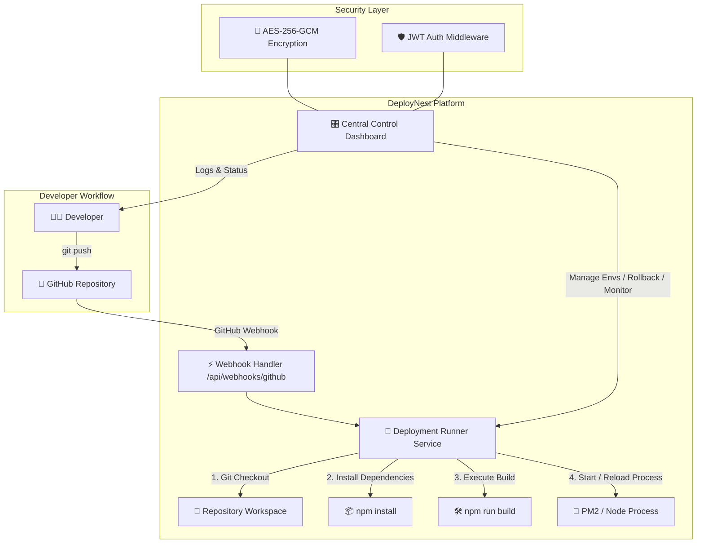

<div align="center">

# 🪺 DeployNest

### *Self-Hosted Centralized CI/CD Hub for your VPS*

[](https://nextjs.org/)
[](https://www.prisma.io/)
[](https://tailwindcss.com/)
[](LICENSE)
[](#)

<p align="center">
  <b>Transform your VPS into a modern, self-hosted deployment engine like Vercel or Render.</b><br/>
  Connect GitHub once → Pick a repository → Define build commands → Deploy automatically on git push.
</p>

```
  ____             _             _   _           _   
 |  _ \  ___ _ __ | | ___  _   _| \ | | ___  ___| |_ 
 | | | |/ _ \ '_ \| |/ _ \| | | |  \| |/ _ \/ __| __|
 | |_| |  __/ |_) | | (_) | |_| | |\  |  __/\__ \ |_ 
 |____/ \___| .__/|_|\___/ \__, |_| \_|\___||___/\__|
            |_|            |___/                     
```

[Key Features](#-key-features) •
[Quick Start](#-quick-start) •
[Architecture](#-architecture) •
[Setup Wizard](#-setup-wizard) •
[Tech Stack](#-tech-stack) •
[License](#-license)

</div>

---

## ⚡ Why DeployNest?

Managing application deployments on a self-hosted VPS often means juggling messy SSH scripts, manually editing systemd units, setting up webhooks from scratch, and searching through raw server log files.

**DeployNest** gives you a **centralized, slick web dashboard** right on your server. It seamlessly connects to your GitHub account, exposes all your repositories, automatically attaches GitHub push webhooks, builds your projects, and manages process lifecycles without requiring manual terminal access.

---

## ✨ Key Features

| Feature | Description |
| :--- | :--- |
| 🔑 **One-Click GitHub Integration** | Connect your GitHub via Personal Access Token (PAT) with AES-256-GCM hardware/secret encryption. |
| 📦 **Automated Push-to-Deploy** | Automatic GitHub Webhooks trigger instantaneous background builds whenever code is pushed. |
| 🛡️ **Self-Hosted Control** | Runs completely on your own server (`0.0.0.0:29870`) — no cloud vendor lock-in or third-party fees. |
| 🎛️ **Centralized Dashboard** | Manage all your app repositories, environment variables, logs, and processes in one place. |
| ⏪ **Instant Rollbacks** | Revert to any previously successful deployment with a single click. |
| 🔐 **Encrypted Secret Vault** | Store environment variables securely per project with hardware-grade encryption. |
| 📊 **Real-Time Streaming Logs** | Monitor live stdout/stderr build and execution logs straight in your browser. |
| 🔮 **Interactive Setup Wizard** | First-run setup guides account creation and GitHub token validation smoothly. |

---

## 🚀 Quick Start

### 1. Prerequisites
- **Node.js**: `v18.x` or later
- **npm** or **yarn**
- **Git**

### 2. Installation

Clone the repository to your target VPS or local machine:

```bash
git clone https://github.com/harshar007/DeployNest.git
cd DeployNest
```

Install dependencies:

```bash
npm install
```

### 3. Database Initialization

Prepare the SQLite database using Prisma:

```bash
# Push the Prisma schema to create deploynest.db
npm run prisma:push

# Generate Prisma Client
npm run prisma:generate
```

### 4. Launch DeployNest

Start the development server (runs on port `29870`):

```bash
npm run dev
```

Or build and run in production mode:

```bash
npm run build
npm start
```

Open your browser and navigate to:
```text
http://localhost:29870/setup
# or http://<YOUR_VPS_IP>:29870/setup
```

---

## 🏗️ Architecture & Deployment Flow



---

## 🧙‍♂️ Setup Wizard Flow

DeployNest comes with an interactive 3-step setup wizard on initial startup:

```
[ Step 1: Create Admin ] ──► [ Step 2: Connect GitHub ] ──► [ Step 3: Deployment Hub Ready ]
```

1. **Create Admin Account**: Establish master authentication credentials.
2. **Connect GitHub Integration**: Provide a Personal Access Token (`repo` + `admin:repo_hook` scopes).
3. **Repository Sync**: DeployNest automatically indexes your repositories and prepares webhooks!

---

## 🧰 Tech Stack

- **Framework**: [Next.js 14](https://nextjs.org/) (App Router, Server Actions, API Routes)
- **Styling**: [Tailwind CSS](https://tailwindcss.com/) + [Lucide Icons](https://lucide.dev/)
- **Database & ORM**: SQLite + [Prisma ORM](https://www.prisma.io/)
- **Security & Crypto**: AES-256-GCM Token Encryption, `bcryptjs` Password Hashing, JWT Authentication
- **GitHub Integration**: [@octokit/rest](https://github.com/octokit/rest.js/)

---

## 📁 Repository Structure

```text
DeployNest/
├── prisma/
│   ├── schema.prisma       # Prisma Database Schema (User, Repo, Deployment, Logs)
│   └── data/               # SQLite database directory
├── src/
│   ├── app/                # Next.js App Router (Pages, API Routes, Setup Wizard)
│   │   ├── api/            # REST API endpoints (Auth, GitHub, Webhooks, Deployments)
│   │   ├── dashboard/      # Control Panel UI
   │   └── setup/          # Interactive Onboarding Wizard
│   ├── components/         # Reusable UI Components (Navbar, Cards, Modals)
│   ├── lib/                # Core Utilities (Auth, Crypto, Db, GitHub Client)
│   └── server/             # Deployment Runner & Execution Engine
├── package.json            # Scripts & Dependencies
└── README.md               # You are here!
```

---

## 📜 Available Scripts

| Script | Command | Description |
| :--- | :--- | :--- |
| `npm run dev` | `next dev -p 29870 -H 0.0.0.0` | Launch dev server accessible across network interface. |
| `npm run build` | `prisma generate && next build` | Compile Prisma client & production Next.js build. |
| `npm run start` | `next start -p 29870 -H 0.0.0.0` | Run production build on port 29870. |
| `npm run prisma:push` | `prisma db push` | Push schema changes directly to SQLite database. |
| `npm run prisma:studio` | `prisma studio` | Open visual database browser. |

---

## 🤝 Contributing

Contributions, issues, and feature requests are welcome!  
Feel free to check out the [Issues page](https://github.com/harshar007/DeployNest/issues).

1. Fork the Project
2. Create your Feature Branch (`git checkout -b feature/AmazingFeature`)
3. Commit your Changes (`git commit -m 'Add some AmazingFeature'`)
4. Push to the Branch (`git push origin feature/AmazingFeature`)
5. Open a Pull Request

---

## 📄 License

Distributed under the **MIT License**. See `LICENSE` for more information.

<div align="center">
  <sub>Built with ❤️ by the DeployNest Team</sub>
</div>
