# DeployNest
## Centralized CI/CD Hub

> **Connect GitHub → Select Repository → Set Path & Commands → Deploy Automatically**

A self-hosted CI/CD platform that runs on a VPS and provides a **fully dashboard-controlled interface** for connecting GitHub repositories, configuring applications, deploying projects, monitoring deployments, and managing running applications.

---

# 1. What Is This Project?

The **Centralized CI/CD Hub** is a web application that runs directly on a VPS.

The user clones the CI/CD Hub repository onto their VPS, installs it, starts it, and opens the dashboard through the VPS public IP.

```text
http://<VPS_PUBLIC_IP>:<PORT>/dashboard
```

From the dashboard, the user connects a GitHub account using a GitHub token.

The platform then:

1. Retrieves accessible GitHub repositories.
2. Displays them in the dashboard.
3. Lets the user select a repository.
4. Lets the user define the deployment path.
5. Lets the user define installation/build/execute commands.
6. Automatically prepares the project on the VPS.
7. Automatically configures the GitHub webhook.
8. Deploys the application.
9. Automatically redeploys whenever the selected branch receives a push.
10. Provides complete control through the dashboard.

---

# 2. Main Idea

The project should make VPS deployment as simple as:

```text
Connect GitHub
      ↓
Select Repository
      ↓
Set Path
      ↓
Set Commands
      ↓
Click Setup & Deploy
      ↓
DONE
```

After that:

```text
Developer
    │
    │ git push
    ▼
GitHub
    │
    │ webhook
    ▼
CI/CD Hub
    │
    ▼
Build
    │
    ▼
Deploy
    │
    ▼
Application Updated
```

---

# 3. Core Principle

> **The dashboard is the central control plane for the entire system.**

Users should be able to manage normal CI/CD operations without manually connecting to the VPS using SSH.

The dashboard controls:

```text
GitHub
Repositories
Deployment
Applications
Environment Variables
Secrets
Webhooks
Logs
Deployment History
Rollback
Server Information
Settings
```

---

# 4. Self-Hosted Model

The CI/CD Hub is itself a GitHub repository.

The user clones the project onto their VPS.

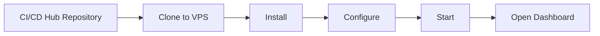

The user does **not** need another cloud service just to run the CI/CD Hub.

The Hub itself becomes the central deployment server.

---

# 5. Default Dashboard URL

After starting the application:

```text
http://<VPS_PUBLIC_IP>:<PORT>/dashboard
```

Example:

```text
http://103.25.10.50:29870/dashboard
```

The port is configurable.

```env
PORT=29870
```

The application should bind to:

```text
0.0.0.0
```

so the dashboard is reachable through the VPS public IP.

---

# 6. First-Time Setup

When the user opens the dashboard for the first time, the system should detect whether setup is complete.

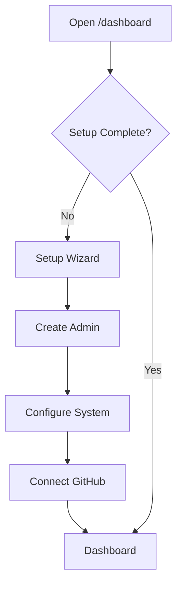

Example setup:

```text
http://VPS_IP:29870/dashboard
        ↓
Create Admin Account
        ↓
Connect GitHub
        ↓
Repositories Appear
        ↓
Ready
```

---

# 7. GitHub Connection

The user connects GitHub from the dashboard.

Example:

```text
┌───────────────────────────────────────────────┐
│ GitHub Integration                            │
├───────────────────────────────────────────────┤
│                                               │
│ GitHub Token                                  │
│ [ **************************************** ]  │
│                                               │
│              [ Connect GitHub ]               │
│                                               │
└───────────────────────────────────────────────┘
```

The backend validates the token.

If valid:

```text
GitHub Token
     ↓
Validate
     ↓
Store Securely
     ↓
Fetch Repositories
     ↓
Display in Dashboard
```

---

# 8. GitHub Token Storage

The token must **not** be stored as plain text.

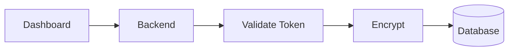

Example database record:

```text
github_connections

id
github_user_id
github_username
encrypted_access_token
last_validated_at
created_at
updated_at
```

The frontend should never receive the original token after storage.

The dashboard can display:

```text
ghp_***********************
```

---

# 9. Repository Synchronization

After GitHub is connected, the Hub uses the stored credentials to retrieve repositories accessible to that account.

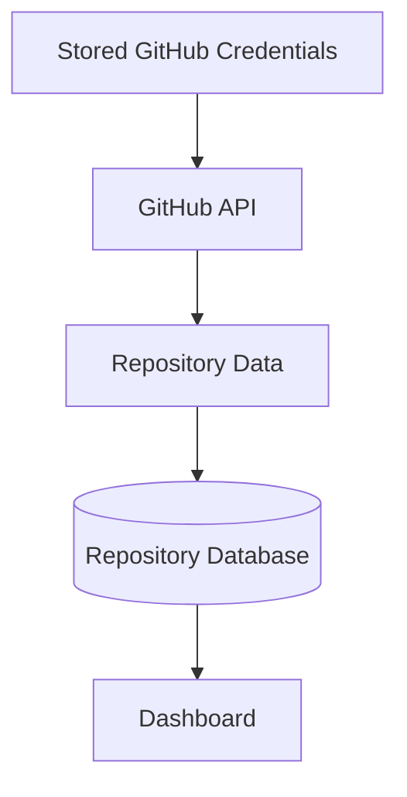

Repository information may include:

```text
Repository ID
Owner
Repository Name
Full Name
Git URL
Default Branch
Visibility
Description
GitHub URL
Last Updated
```

---

# 10. Repository Dashboard

The dashboard displays repositories automatically.

Example:

```text
┌─────────────────────────────────────────────────────────┐
│ Repositories                                            │
├─────────────────────────────────────────────────────────┤
│                                                         │
│ teader                                                  │
│ ajaysaagar-dev/teader                                  │
│ main                                                    │
│ Not Configured                     [ Configure ]       │
│                                                         │
│ backend                                                 │
│ ajaysaagar-dev/backend                                 │
│ main                                                    │
│ Running                           [ Manage ]            │
│                                                         │
│ portfolio                                               │
│ ajaysaagar-dev/portfolio                               │
│ main                                                    │
│ Not Configured                     [ Configure ]       │
│                                                         │
└─────────────────────────────────────────────────────────┘
```

---

# 11. Repository States

A repository can have different states.

```text
NOT_CONFIGURED
       ↓
CONFIGURED
       ↓
DEPLOYING
       ↓
RUNNING
```

Possible failure state:

```text
RUNNING
   ↓
DEPLOYMENT
   ↓
FAILED
```

The dashboard should clearly show the current state.

---

# 12. Repository Configuration

After selecting a repository, the user configures the application.

```text
┌──────────────────────────────────────────────────────────┐
│ Configure Repository                                     │
├──────────────────────────────────────────────────────────┤
│                                                          │
│ Repository                                               │
│ ajaysaagar-dev/teader                                    │
│                                                          │
│ Branch                                                   │
│ [ main                                           ▼ ]     │
│                                                          │
│ Base Runnable Path                                       │
│ [ /var/www/teader                               ]        │
│                                                          │
│ Install / Build Command                                 │
│ [ npm install && npm run build                   ]       │
│                                                          │
│ Execute / Start Command                                  │
│ [ npm start                                       ]      │
│                                                          │
│ Port                                                     │
│ [ 3000                                          ]        │
│                                                          │
│ Auto Deploy                                              │
│ [ ✓ Enabled ]                                            │
│                                                          │
│              [ Setup & Deploy ]                          │
│                                                          │
└──────────────────────────────────────────────────────────┘
```

The user mainly needs to provide:

```text
Branch
Path
Build / Install Command
Start / Execute Command
Port
```

---

# 13. Base Runnable Path

The **Base Runnable Path** defines where the repository is managed on the VPS.

Example:

```text
/var/www/teader
```

Another project:

```text
/var/www/my-api
```

The system should keep projects separated.

```text
/var/www/
│
├── teader/
├── my-api/
├── portfolio/
└── dashboard/
```

---

# 14. Project Setup

When the user clicks:

```text
Setup & Deploy
```

the Hub automatically prepares the selected repository.

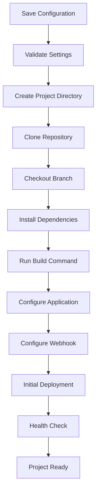

The user does not need to manually execute the setup commands over SSH.

---

# 15. What the Hub Does Automatically

For example, if the user enters:

```text
Repository:
teader

Branch:
main

Path:
/var/www/teader

Build:
npm install && npm run build

Start:
npm start
```

the Hub handles:

```text
Create directory
      ↓
Clone repository
      ↓
Checkout main
      ↓
Install dependencies
      ↓
Build project
      ↓
Configure application
      ↓
Configure webhook
      ↓
Start application
      ↓
Check application
```

---

# 16. GitHub Webhook Automation

The Hub should automatically configure the GitHub repository for push-based deployment.

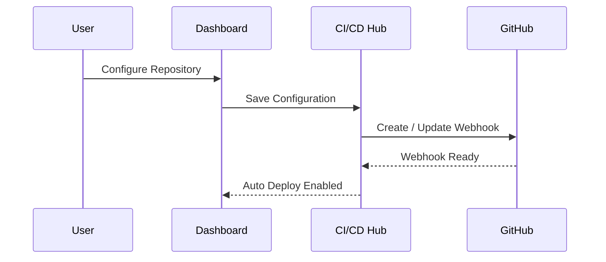

The webhook points to:

```text
http://<VPS_PUBLIC_IP>:<PORT>/api/webhooks/github
```

For production usage:

```text
https://<DOMAIN>/api/webhooks/github
```

HTTPS should be preferred for internet-facing production deployments.

---

# 17. Push-to-Deploy

Once the repository is configured, the developer does not need to interact with the dashboard for every deployment.

They simply push code.

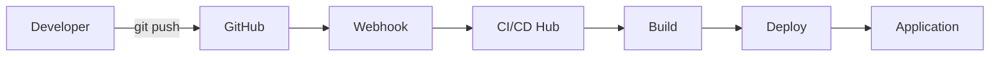

Example:

```bash
git add .
git commit -m "Update application"
git push origin main
```

The push automatically starts deployment.

---

# 18. Automatic Deployment Flow

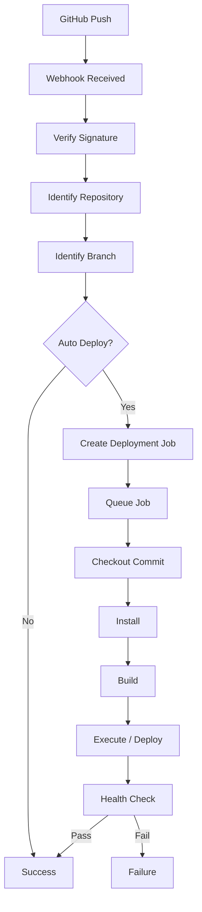

---

# 19. Deployment Queue

Deployment jobs should be processed asynchronously.

The webhook should not directly perform the full deployment.

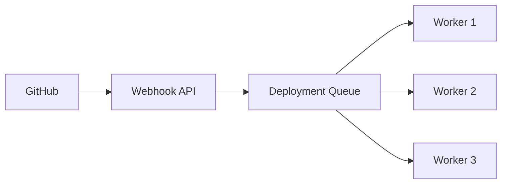

Recommended:

```text
Redis
BullMQ
```

Benefits:

* Reliable deployment processing
* Retry support
* Multiple workers
* Better webhook performance
* Job tracking
* Deployment concurrency control

---

# 20. Deployment Worker

The deployment worker performs the actual project operations.

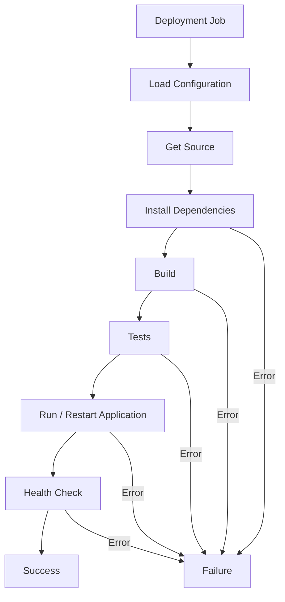

---

# 21. Deployment Status

Each deployment should have a status.

```text
QUEUED
   ↓
PREPARING
   ↓
CHECKING_OUT
   ↓
INSTALLING
   ↓
BUILDING
   ↓
TESTING
   ↓
DEPLOYING
   ↓
HEALTH_CHECK
   ↓
SUCCESS
```

Failure:

```text
Any Stage
   ↓
FAILED
```

---

# 22. Deployment Page

Example:

```text
┌─────────────────────────────────────────────────────────┐
│ Deployment #184                                        │
├─────────────────────────────────────────────────────────┤
│                                                         │
│ Repository: teader                                      │
│ Branch:     main                                        │
│ Commit:     8f3a91c                                    │
│ Status:     ● RUNNING                                  │
│                                                         │
│ ✓ Webhook Received                                      │
│ ✓ Repository Checkout                                   │
│ ✓ Dependencies Installed                                │
│ ✓ Build Completed                                       │
│ ● Deploying                                             │
│ ○ Health Check                                          │
│                                                         │
└─────────────────────────────────────────────────────────┘
```

---

# 23. Application Management

After deployment, the dashboard should control the application lifecycle.

Available actions:

```text
Deploy
Start
Stop
Restart
Reload
Status
Logs
Rollback
```

Example:

```text
┌───────────────────────────────────────────────┐
│ teader                                        │
├───────────────────────────────────────────────┤
│ Status: ● Running                             │
│ Port: 3000                                    │
│ Path: /var/www/teader                         │
│                                               │
│ [ Deploy ] [ Restart ] [ Stop ]               │
│ [ Logs ]   [ Rollback ]                       │
└───────────────────────────────────────────────┘
```

---

# 24. Process Management

The Hub can initially support:

```text
PM2
Systemd
Docker
```

For example:

```text
Start Command:
npm start

Process Manager:
PM2

Application Name:
teader
```

The actual process-management implementation should remain inside the backend/worker and be controlled through the dashboard.

---

# 25. Health Checks

After deployment, the Hub should verify that the application is working.

Example:

```text
Health Check URL:

http://localhost:3000/health
```

Flow:

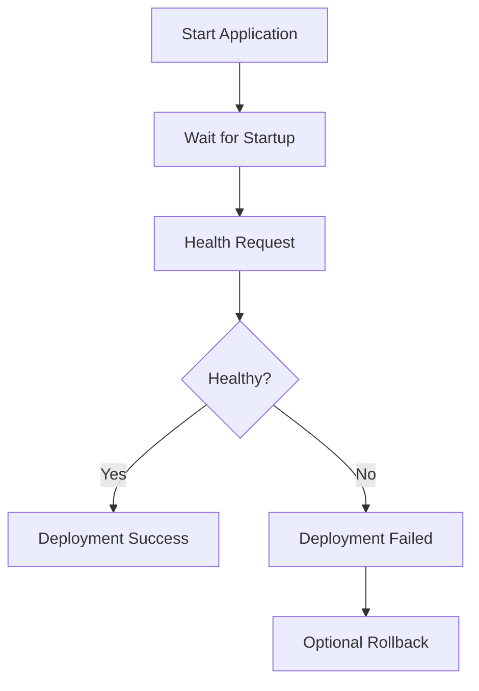

---

# 26. Environment Variables

Environment configuration should be managed from the dashboard.

Example:

```text
NODE_ENV=production
PORT=3000
DATABASE_URL=********
JWT_SECRET=********
API_KEY=********
```

Dashboard:

```text
┌──────────────────────────────────────────────┐
│ Environment                                  │
├──────────────────────────────────────────────┤
│ NODE_ENV       production                    │
│ PORT           3000                          │
│ DATABASE_URL   *************                 │
│ JWT_SECRET     *************                 │
│ API_KEY        *************                 │
│                                              │
│ [ Add Variable ] [ Save ]                   │
└──────────────────────────────────────────────┘
```

---

# 27. Secrets

Secrets must be:

* Encrypted in the database.
* Hidden from the frontend.
* Hidden from logs.
* Accessible only to authorized processes.

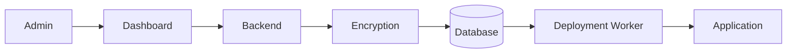

---

# 28. Deployment Logs

Every deployment should store logs.

Example:

```text
[18:05:21] Deployment started
[18:05:24] Repository checkout
[18:05:31] Dependencies installed
[18:05:47] Build started
[18:06:12] Build completed
[18:06:15] Application restarted
[18:06:25] Application started
[18:06:38] Health check passed
[18:06:40] Deployment successful
```

The logs should be accessible directly from the dashboard.

---

# 29. Deployment History

Each repository should maintain deployment history.

```text
┌────────────────────────────────────────────────────────┐
│ Deployment History                                      │
├────────────────────────────────────────────────────────┤
│                                                        │
│ 8f3a91c    main    ✓ Success    2 min ago             │
│ 1d92ab4    main    ✓ Success    1 hour ago            │
│ 7ac9211    main    ✕ Failed     2 hours ago           │
│ 91ac221    main    ✓ Success    5 hours ago           │
│                                                        │
└────────────────────────────────────────────────────────┘
```

---

# 30. Rollback

The dashboard should allow restoring a previous successful deployment.

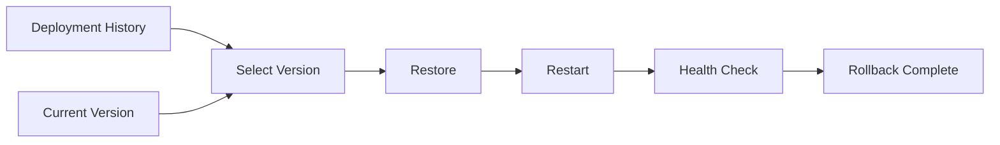

Example:

```text
Current:
8f3a91c

Previous:
1d92ab4

[ Rollback to 1d92ab4 ]
```

---

# 31. Dashboard as Central Control Plane

The dashboard should control the complete system.

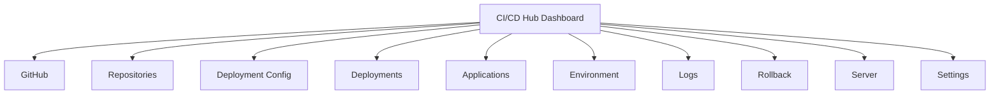

The dashboard is not only a monitoring interface.

It is the **main operational interface**.

---

# 32. Dashboard Sections

Recommended navigation:

```text
Dashboard
Repositories
Applications
Deployments
Servers
Environment
Logs
GitHub
Notifications
Users
Settings
```

---

# 33. Main Dashboard

Example:

```text
┌──────────────────────────────────────────────────────────┐
│ CI/CD HUB                                                 │
├──────────────────────────────────────────────────────────┤
│                                                          │
│ Repositories     Running Apps     Deployments     Failed  │
│      24                12              186          7     │
│                                                          │
├──────────────────────────────────────────────────────────┤
│ Recent Deployments                                        │
│                                                          │
│ ✓ teader        main       2 min ago                    │
│ ✓ backend       main       8 min ago                    │
│ ✕ dashboard     develop    14 min ago                   │
│ ✓ portfolio     main       21 min ago                   │
│                                                          │
├──────────────────────────────────────────────────────────┤
│ VPS Health                                                │
│                                                          │
│ CPU     24%                                               │
│ RAM     65%                                               │
│ DISK    42%                                               │
│                                                          │
└──────────────────────────────────────────────────────────┘
```

---

# 34. Complete System Architecture

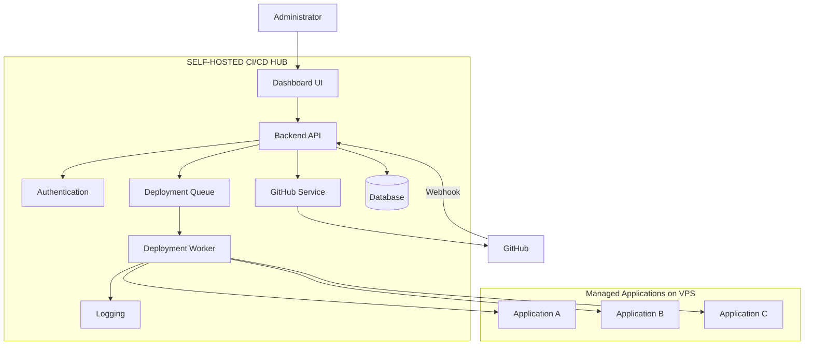

---

# 35. Control Plane vs Execution Plane

The architecture should separate management from execution.

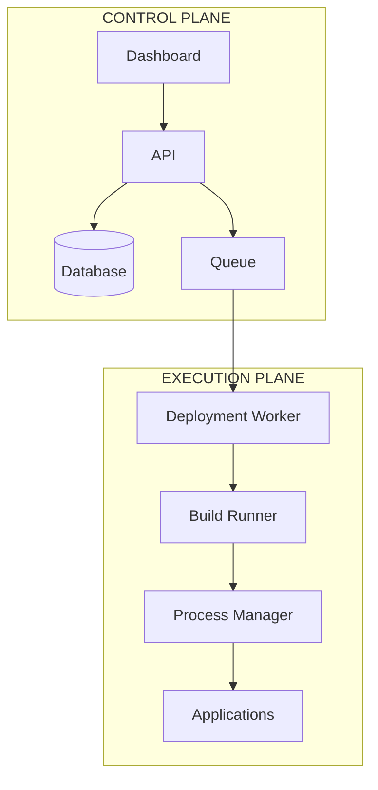

### Control Plane

Responsible for:

```text
Dashboard
Users
Configuration
Repositories
Deployments
Permissions
Settings
```

### Execution Plane

Responsible for:

```text
Clone
Build
Test
Deploy
Start
Stop
Restart
Health Check
```

---

# 36. Single VPS Architecture

The MVP can run everything on one VPS.

```text
VPS
│
├── CI/CD Hub
│   ├── Dashboard
│   ├── API
│   ├── Worker
│   └── Database
│
├── Repository A
│   └── Application A
│
├── Repository B
│   └── Application B
│
└── Repository C
    └── Application C
```

Diagram:

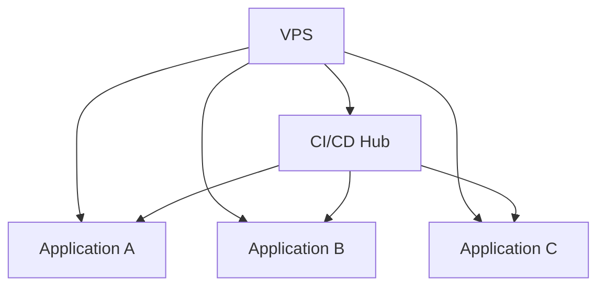

---

# 37. Directory Structure on VPS

A recommended layout:

```text
/opt/cicd-hub/
│
├── application/
├── .env
└── logs/

/var/lib/cicd-hub/
│
├── repositories/
│   ├── repo-a/
│   ├── repo-b/
│   └── repo-c/
│
├── releases/
│   ├── repo-a/
│   ├── repo-b/
│   └── repo-c/
│
└── logs/
```

Keeping the Hub itself separate from managed applications reduces conflicts.

---

# 38. Database Design

The database should contain the main entities.

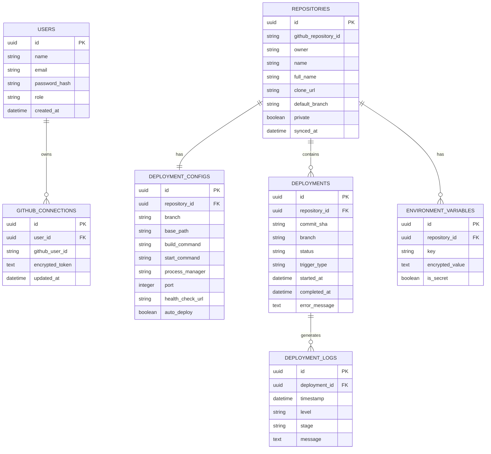

---

# 39. API Structure

Example API:

```text
Authentication

POST /api/auth/login
POST /api/auth/logout
GET  /api/auth/me
```

GitHub:

```text
GET    /api/github/status
POST   /api/github/connect
POST   /api/github/sync
DELETE /api/github/disconnect
```

Repositories:

```text
GET /api/repositories
GET /api/repositories/:id
```

Configuration:

```text
GET  /api/repositories/:id/config
POST /api/repositories/:id/config
PUT  /api/repositories/:id/config
```

Deployments:

```text
POST /api/repositories/:id/deploy
GET  /api/repositories/:id/deployments
GET  /api/deployments/:id
GET  /api/deployments/:id/logs
POST /api/deployments/:id/rollback
```

Application:

```text
POST /api/repositories/:id/start
POST /api/repositories/:id/stop
POST /api/repositories/:id/restart
GET  /api/repositories/:id/status
```

Webhook:

```text
POST /api/webhooks/github
```

Health:

```text
GET /api/health
```

---

# 40. Recommended Technology Stack

## Frontend

```text
Next.js
React
TypeScript
Tailwind CSS
```

## Backend

```text
Node.js
TypeScript
Fastify / NestJS
```

## Database

```text
PostgreSQL
Prisma
```

## Queue

```text
Redis
BullMQ
```

## GitHub

```text
GitHub API
GitHub Webhooks
GitHub Token

Future:
GitHub App
```

## Process / Deployment

```text
Git
PM2
Systemd
Docker
```

---

# 41. Project Structure

```text
cicd-hub/
│
├── apps/
│   ├── dashboard/
│   │   ├── app/
│   │   ├── components/
│   │   ├── hooks/
│   │   └── lib/
│   │
│   └── api/
│       ├── routes/
│       ├── controllers/
│       ├── services/
│       └── middleware/
│
├── workers/
│   └── deployment-worker/
│       ├── jobs/
│       ├── runners/
│       ├── executors/
│       └── health-check/
│
├── packages/
│   ├── database/
│   ├── github/
│   ├── deployment/
│   ├── security/
│   ├── logger/
│   └── shared/
│
├── prisma/
│   ├── schema.prisma
│   └── migrations/
│
├── infrastructure/
│   ├── scripts/
│   ├── docker/
│   └── nginx/
│
├── .env.example
├── docker-compose.yml
├── package.json
└── README.md
```

---

# 42. Installation

Basic installation:

```bash
git clone https://github.com/<organization>/cicd-hub.git

cd cicd-hub

npm install

cp .env.example .env

npm run build

npm start
```

Then open:

```text
http://<VPS_PUBLIC_IP>:29870/dashboard
```

---

# 43. Environment Configuration

Example:

```env
NODE_ENV=production

HOST=0.0.0.0
PORT=29870

APP_URL=http://<VPS_PUBLIC_IP>:29870

DATABASE_URL=postgresql://...

REDIS_URL=redis://...

GITHUB_WEBHOOK_SECRET=...

ENCRYPTION_KEY=...

DEPLOYMENT_ROOT=/var/lib/cicd-hub
```

---

# 44. Security

The Hub has significant server permissions, so security is extremely important.

## GitHub Credentials

Tokens must:

```text
Be encrypted
Never appear in logs
Never be exposed to frontend
Use minimum required permissions
```

## Webhooks

Webhook signatures must be validated before creating deployment jobs.

```text
GitHub Request
      ↓
Signature Validation
      ↓
Valid?
   ┌──┴──┐
   │     │
  YES    NO
   │     │
   ↓     ↓
Process Reject
```

## File Paths

Deployment paths must be validated.

Unsafe paths such as:

```text
../../etc
../../../root
/etc
```

should not be accepted without explicit controlled access.

## Commands

Commands should not be executed blindly from arbitrary API input.

The execution layer should control:

```text
Working Directory
User Permissions
Environment
Allowed Operations
Timeouts
Exit Codes
Logging
```

---

# 45. Dashboard Security

The dashboard should require authentication.

Minimum MVP:

```text
Admin Email
Admin Password
```

Future:

```text
GitHub OAuth
Two-Factor Authentication
Role-Based Access Control
API Keys
Audit Logs
```

---

# 46. Automatic Deployment Safety

A failed deployment should not automatically destroy a healthy running application.

Preferred flow:

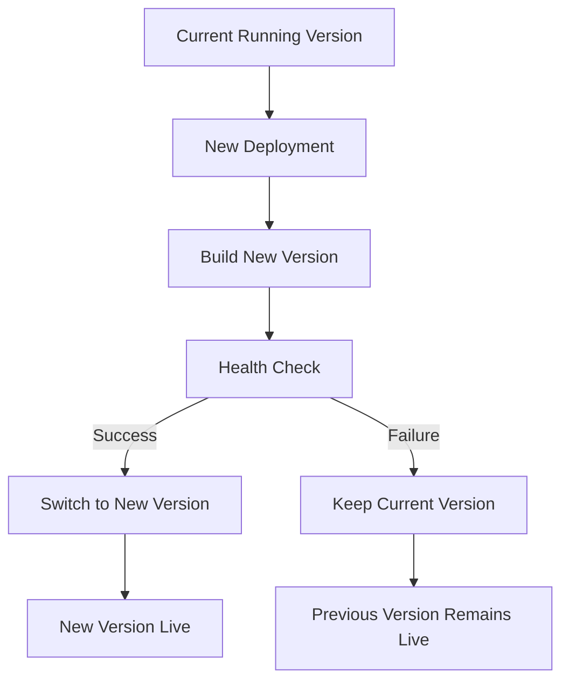

This becomes more important when release-based deployment is implemented.

---

# 47. MVP

The first version should remain simple.

## Required

```text
✓ Admin Login
✓ GitHub Token
✓ Secure Token Storage
✓ Repository Synchronization
✓ Repository Dashboard
✓ Repository Selection
✓ Deployment Path
✓ Build Command
✓ Start Command
✓ Port
✓ GitHub Webhook
✓ Automatic Deployment
✓ Manual Deployment
✓ Deployment Queue
✓ Deployment Worker
✓ Deployment Logs
✓ Application Status
✓ Start / Stop / Restart
✓ Deployment History
```

---

# 48. Phase 2

After the MVP works:

```text
Health Checks
Rollback
Environment Variables
Encrypted Secrets
Notifications
Automatic Framework Detection
Docker Deployment
Better Release Management
```

---

# 49. Phase 3

Infrastructure improvements:

```text
Multiple VPS Servers
Server Monitoring
Domain Management
Automatic SSL
Zero-Downtime Deployment
Blue/Green Deployment
Canary Deployment
```

---

# 50. Phase 4

Platform expansion:

```text
GitLab
Bitbucket
Azure DevOps

Teams
Organizations
RBAC
Audit Logs
Multi-Tenant Support
```

---

# 51. Future Multi-VPS Architecture

The MVP uses one VPS, but the architecture should allow more servers later.

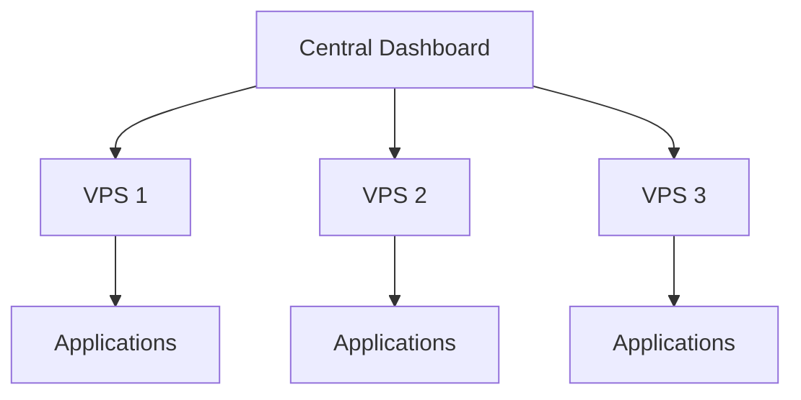

The repository configuration could eventually include:

```text
Deployment Server:
VPS-02
```

---

# 52. Automatic Technology Detection

A future feature can detect the project type automatically.

```mermaid
flowchart TD
    REPO["Repository"]
    SCAN["Scan Files"]

    REPO --> SCAN

    SCAN --> NPM{"package.json?"}
    SCAN --> PY{"requirements.txt?"}
    SCAN --> PHP{"composer.json?"}
    SCAN --> DOCKER{"Dockerfile?"}

    NPM -->|Yes| NODE["Node.js"]
    PY -->|Yes| PYTHON["Python"]
    PHP -->|Yes| PHPAPP["PHP"]
    DOCKER -->|Yes| DOCKERAPP["Docker"]
```

The dashboard can then suggest commands.

Example:

```text
Detected:
Next.js

Suggested Install:
npm install

Suggested Build:
npm run build

Suggested Start:
npm start
```

The user can still modify them.

---

# 53. Domain and SSL

Future dashboard functionality:

```text
Application:
teader

Domain:
teader.example.com

Port:
3000

HTTPS:
Enabled
```

The Hub can eventually manage:

```text
Reverse Proxy
Domain Routing
SSL
Certificate Renewal
```

---

# 54. Notifications

Future deployment notifications:

```text
Deployment Successful
Deployment Failed
Rollback Completed
Application Offline
Health Check Failed
```

Possible providers:

```text
Email
Slack
Discord
Telegram
```

---

# 55. Complete End-to-End Workflow

```mermaid
flowchart TD

    START["User Creates VPS"]

    CLONE["Clone CI/CD Hub"]
    INSTALL["Install & Start"]
    DASH["Open /dashboard"]

    ADMIN["Create Admin"]
    TOKEN["Add GitHub Token"]
    SYNC["Sync Repositories"]

    SELECT["Select Repository"]
    CONFIG["Configure Path & Commands"]

    SETUP["Automatic Project Setup"]
    HOOK["Automatic GitHub Webhook"]
    DEPLOY["Initial Deployment"]

    PUSH["Developer Push"]
    EVENT["GitHub Webhook"]
    BUILD["Build"]
    AUTO["Automatic Deployment"]

    MONITOR["Dashboard Monitoring"]

    START --> CLONE
    CLONE --> INSTALL
    INSTALL --> DASH
    DASH --> ADMIN
    ADMIN --> TOKEN
    TOKEN --> SYNC
    SYNC --> SELECT
    SELECT --> CONFIG
    CONFIG --> SETUP
    SETUP --> HOOK
    HOOK --> DEPLOY
    DEPLOY --> MONITOR

    PUSH --> EVENT
    EVENT --> BUILD
    BUILD --> AUTO
    AUTO --> MONITOR
```

---

# 56. Final User Experience

The entire product should feel like this:

```text
┌──────────────────────────────────────────────────────┐
│                   CI/CD HUB                          │
├──────────────────────────────────────────────────────┤
│                                                      │
│ Step 1                                              │
│ Connect GitHub                                      │
│                                                      │
│ Step 2                                              │
│ Select Repository                                   │
│                                                      │
│ Step 3                                              │
│ Set Deployment Path                                 │
│                                                      │
│ Step 4                                              │
│ Set Build / Execute Commands                        │
│                                                      │
│ Step 5                                              │
│ Click "Setup & Deploy"                              │
│                                                      │
│                  Application Running ✓              │
│                                                      │
└──────────────────────────────────────────────────────┘
```

After that:

```text
git push
   ↓
GitHub
   ↓
Webhook
   ↓
CI/CD Hub
   ↓
Build
   ↓
Deploy
   ↓
Application Updated
```

And the entire process can be viewed and controlled from:

```text
http://<VPS_PUBLIC_IP>:<PORT>/dashboard
```

---

# 57. Core Product Flow

```mermaid
flowchart LR

    GITHUB["GitHub"]

    REPOS["All Accessible Repositories"]

    SELECT["Select Repository"]

    CONFIG["Set Path + Commands"]

    SETUP["Automatic Setup"]

    WEBHOOK["Automatic Webhook"]

    PUSH["Git Push"]

    DEPLOY["Automatic Deployment"]

    APP["Running Application"]

    DASH["Dashboard"]

    GITHUB --> REPOS
    REPOS --> SELECT
    SELECT --> CONFIG
    CONFIG --> SETUP
    SETUP --> WEBHOOK

    WEBHOOK --> PUSH
    PUSH --> DEPLOY
    DEPLOY --> APP

    DASH --> SELECT
    DASH --> CONFIG
    DASH --> DEPLOY
    DASH --> APP
```

---

# 58. Product Definition

**Name:**

```text
Centralized CI/CD Hub
```

**Type:**

```text
Self-Hosted CI/CD & Deployment Platform
```

**Runs On:**

```text
VPS / Linux Server
```

**Primary Interface:**

```text
Web Dashboard
```

**Primary Git Provider:**

```text
GitHub
```

**Default Dashboard:**

```text
http://VPS_PUBLIC_IP:PORT/dashboard
```

**Primary Goal:**

```text
Centralize repository deployment and VPS application management.
```

---

# 59. Core Principle

> **Connect GitHub once. Access all authorized repositories. Select a repository. Set the deployment path and execution commands. The Hub automatically prepares the project, configures GitHub push-to-deploy, deploys the application, and provides complete control through the dashboard.**

---

# 60. Final Vision

```mermaid
flowchart TB

    USER["Developer / Administrator"]

    DASH["CENTRALIZED CI/CD HUB\n/dashboard"]

    GITHUB["GitHub"]
    REPOSITORIES["Repositories"]
    PIPELINES["CI/CD Pipelines"]
    DEPLOYMENTS["Deployments"]
    APPLICATIONS["Applications"]
    SERVERS["VPS"]
    LOGS["Logs"]
    SECRETS["Secrets"]
    MONITOR["Monitoring"]

    USER --> DASH

    DASH --> GITHUB
    DASH --> REPOSITORIES
    DASH --> PIPELINES
    DASH --> DEPLOYMENTS
    DASH --> APPLICATIONS
    DASH --> SERVERS
    DASH --> LOGS
    DASH --> SECRETS
    DASH --> MONITOR

    GITHUB -->|"Push"| PIPELINES
    PIPELINES --> DEPLOYMENTS
    DEPLOYMENTS --> APPLICATIONS
    APPLICATIONS --> SERVERS
```

## One-Line Product Description

> **A self-hosted, dashboard-first CI/CD platform that turns a VPS into a centralized deployment hub for all your GitHub repositories.**

## Ultimate Goal

```text
One VPS
   +
One CI/CD Hub
   +
One Dashboard
   +
GitHub
   ↓
Centralized Application Deployment
```

> **One Dashboard. All Repositories. All Deployments. Full Control.**
